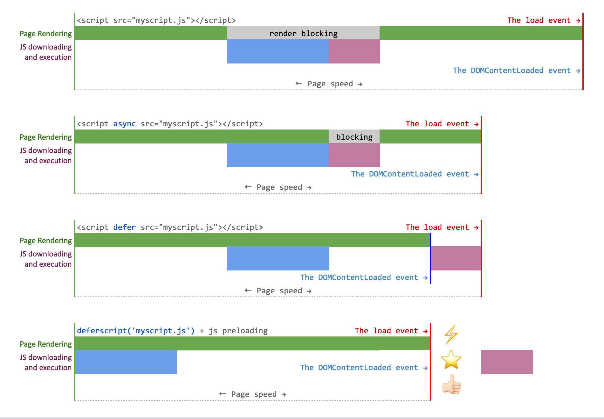

# @shinsenter/defer.js

🥇 A super tiny, native performant library for lazy-loading JS, CSS, images, iframes... Defer almost anything, easily speed up your website.


[](https://www.codefactor.io/repository/github/shinsenter/defer.js)

[](https://github.com/shinsenter/defer.js/issues)


## Table of Contents


- [Table of Contents](#table-of-contents)
- [Key notes](#key-notes)
- [Browser support](#browser-support)
- [Install to your page](#install-to-your-page)
- [Basic usage](#basic-usage)
    - [Defer loading of JavaScript](#defer-loading-of-javascript)
    - [Lazy-load stylesheets](#lazy-load-stylesheets)
    - [Lazy-load media](#lazy-load-media)
        - [Lazy an image or a video](#lazy-an-image-or-a-video)
            - [Basic HTML markup](#basic-html-markup)
            - [Lazy an image with low quality placeholder](#lazy-an-image-with-low-quality-placeholder)
            - [Lazy a responsive image with `srcset` and `sizes` attributes](#lazy-a-responsive-image-with-srcset-and-sizes-attributes)
            - [Lazy a responsive image with flexible format selection](#lazy-a-responsive-image-with-flexible-format-selection)
            - [Lazy a responsive image with retina or Hi-DPI support](#lazy-a-responsive-image-with-retina-or-hi-dpi-support)
            - [Lazy a video](#lazy-a-video)
        - [Lazy an iframe](#lazy-an-iframe)
            - [Basic HTML markup](#basic-html-markup)
            - [Lazy a Youtube video](#lazy-a-youtube-video)
            - [Lazy a Facebook post](#lazy-a-facebook-post)
    - [Minimal version](#minimal-version)
- [Tips and tricks](#tips-and-tricks)
- [Advanced usage (for PROs)](#advanced-usage)
    - [defer](#defer)
    - [deferscript](#deferscript)
    - [deferstyle](#deferstyle)
    - [deferimg](#deferimg)
    - [deferiframe](#deferiframe)
- [Demo](#demo)
- [One more thing](#one-more-thing)
- [Keep in touch](#keep-in-touch)


## Key notes


Other lazy loading libraries hook up to the scroll event on elements that need to be lazy loaded. This approach forces the browser to re-layout the page and it is painfully slow.

Here we are, [defer.js](https://github.com/shinsenter/defer.js) is written in plain JavaScript, making lazy-loading more efficient and performant. This library is using the recently added [Intersection Observer](https://developers.google.com/web/updates/2016/04/intersectionobserver) with tremendous native performance benefits.

- Legacy browsers support (IE9+)
- SEO friendly
- Very easy to use
- No dependencies, no jQuery
- Works well with your favorite frameworks
- Uses [IntersectionObserver API](https://developer.mozilla.org/en-US/docs/Web/API/Intersection_Observer_API) for optimized CPU usage
- Supports for responsive images, both `srcset` and `sizes` attributes


## Browser support

Available in latest browsers. This library also works perfectly with Internet Explorer 9 and later.

- IE9+ (with [W3C's Intersection Observer polyfill](https://github.com/w3c/IntersectionObserver))
- Firefox 4+
- Safari 3+
- Chrome *
- Opera *
- Android 4+
- iOS 3.2+


## Install to your page


You can load the library via **CDN** and include it right after the opening `<head>` tag of your page.

```html
<head>
    <title>My awesome page</title>
    <script src="//cdn.jsdelivr.net/npm/@shinsenter/defer.js@latest/dist/defer_plus.min.js"></script>
    <!-- And other HTML tags from here -->
</head>
```

💡 Best practice: Because the minified version is super tiny (less than 1KB), you can inline its content directly into the HTML document and avoid the network request.


Or you can install [defer.js package](https://npmjs.com/package/@shinsenter/defer.js) with npm:

```bash
npm install @shinsenter/defer.js
```


## Basic usage


### Defer loading of JavaScript

According to a [Google PageSpeed Insights article](https://developers.google.com/speed/docs/insights/BlockingJS#deferJS):

> The loading and execution of scripts that are not necessary for the initial page render may be deferred until after the initial render or other critical parts of the page have finished loading. Doing so can help reduce resource contention and improve performance.

But in real life, many JavaScript libraries, such as JQuery, are used to enhance the page to add additional interactivity, animations, and other effects. It takes time for browser to parse and execute those scripts, and each UI change may reflow your layout, make your load speed more slow.

In various cases, using `async` or `defer` does not deliver faster page speed than [defer](#defer) or [deferscript](#deferscript) does.




All you need to do now is just wrap all your code in `defer()` function.

```html
<script type="text/javascript">
    // This will defer showing an alert message after 2 seconds
    defer(function() {
        alert("This message is shown after 2 seconds after the 'load' event.");
    }, 2000);

    // Append a HTML content to the <body> tag using jQuery
    defer(function () {
        $('body').html('<p>Your awesome content</p>');
    }, 500);
</script>
```


Or defer loading and execution of external scripts with `deferscript()` function.

```html
<script type="text/javascript">
    // Alternative way to lazy load Google Tag Manager script
    deferscript('//www.googletagmanager.com/gtag/js?id=UA-34520609-2', 'google-tag', 500, function() {
        // Run extra code right after the script has been loaded
        (window.dataLayer = window.dataLayer || []).push('config', 'UA-34520609-2');
    });
</script>
```


### Lazy-load stylesheets

Along with lazied JavaScript, lazy-loading big CSS files of the document makes sense, because some times - on a slow connection - a user may wait for a maximum of 5 to 6 seconds loading your CSS files.

While the CSS files are loading, **the website is still blank**. When the browser takes up a lot of time to load your CSS files, the user may hit the back button! You just **lost a potential subscriber**.


Luckily, you can also defer you CSS files which your users may not need yet, like this:

```html
<script type="text/javascript">
    // This will lzay-load FontAwesome icons
    deferstyle('//use.fontawesome.com/releases/v5.7.2/css/all.css', 'fontawesome-css', 1000);
</script>
```


### Lazy-load media

In order to lazy-load your content, you must use some `data-` attributes instead of the actual attributes. See examples below.

💡 Best practice: To polyfill the native IntersectionObserver API in unsupporting browsers such as IE9, you may need to include below script right after the `defer_plus.min.js`.

```html
<script src="//cdn.jsdelivr.net/npm/@shinsenter/defer.js@latest/dist/defer_plus.min.js"></script>
<script>
    deferscript('//cdn.jsdelivr.net/npm/@shinsenter/defer.js@latest/dist/polyfill.min.js', 'polyfill-js', 1);
</script>
```


#### Lazy an image or a video

Put this script anywhere you want within the `<body>` tag:

```html
<script>deferimg('img[data-src], source[data-src]')</script>
```


##### Basic HTML markup

```html

```


##### Lazy an image with low quality placeholder

```html

```


##### Lazy a responsive image with srcset and sizes attributes

```html

```


##### Lazy a responsive image with flexible format selection

```html
<picture>
    <source type="image/webp" data-sizes="100w"
            data-srcset="lazy-360.webp 360w, lazy-640.webp 640w">
    
</picture>
```


##### Lazy a responsive image with retina or Hi-DPI support

```html
<picture>
    <source media="(min-width: 800px)"
            data-srcset="lazy-800.jpg 1x, lazy-1600.jpg 2x">
    <source media="(min-width: 640px)"
            data-srcset="lazy-640.jpg 1x, lazy-1280.jpg 2x">
    
</picture>
```


##### Lazy a video

```html
<video class="lazy" controls width="720" data-src="lazy.mp4" poster="lazy.jpg">
    <source type="video/mp4" data-src="lazy.mp4">
    <source type="video/ogg" data-src="lazy.ogg">
    <source type="video/avi" data-src="lazy.avi">
</video>
```


#### Lazy an iframe

Put this script anywhere you want within the `<body>` tag:

```html
<script>deferiframe('iframe[data-src],[data-style]')</script>
```


##### Basic HTML markup

```html
<iframe src="about:blank"
        data-src="lazy-frame.html"
        data-style="background: transparent url(lazy.jpg) 50% 50% / cover no-repeat;"></iframe>
```


##### Lazy a Youtube video

```html
<iframe src="about:blank"
        data-src="https://www.youtube.com/embed/<youtube-video-id>"
        data-style="background: transparent url(https://img.youtube.com/vi/<youtube-video-id>/hqdefault.jpg) 50% 50% / cover no-repeat;"
        frameborder="0" width="560" height="315" allowfullscreen
        allow="accelerometer; autoplay; encrypted-media; gyroscope; picture-in-picture"></iframe>
```


##### Lazy a Facebook post

```html
<iframe src="about:blank"
        data-src="https://www.facebook.com/plugins/post.php?href=https%3A%2F%2Fwww.facebook.com%2Fappseeds%2Fposts%2F1502937099839267&width=500&show_text=true&height=500"
        width="500" height="500"
        data-style="border:none;overflow:hidden"
        scrolling="no" frameborder="0" allowTransparency="true" allow="encrypted-media"></iframe>
```


### Minimal version

If you only need the `defer()` and `deferscript()` functions for lazy-loading JavaScript, you can use a [super-super compact version](https://github.com/shinsenter/defer.js/blob/develop/dist/defer.min.js) (under 500 bytes), as below:

```html
<head>
    <title>My awesome page</title>
    <script src="//cdn.jsdelivr.net/npm/@shinsenter/defer.js@latest/dist/defer.min.js"></script>
</head>
```

Yes, you can inline the whole script in your HTML document for better pagespeed performance.


## Tips and tricks


### Maintain aspect ratio of video/image

The core concept is padding in percentages is based on width.

It is weird: `padding-top` and `padding-bottom` is based on an element's width. So if you had an `padding-top` of 56.25%, it happens to be a perfect 16:9 ratio! (9 / 16 = 0.5625). And with `padding-top` of 100%, we have a perfect square.

So we are going to make a set of CSS classes that supports common aspect ratios.

```css
div.aspect {
    margin: 0;
    padding-top: 75%; /* default is 4:3 ratio */
    max-width: 100%;
    height: 0;
    overflow: hidden;
    position: relative;
}

div.aspect.wide {
    padding-top: 56.25%;
}

div.aspect.square {
    padding-top: 50%;
}
```

How do you put content inside if `padding-top` is pushing everything down?

We hid the content in the box with `overflow: hidden`, and we'll need an inside wrapper for the absolute positioning. Let's get specific with below CSS:

```css
div.aspect > * {
    display: block;
    position: absolute;
    left: 0;
    top: 0;
    width: 100%;
    height: 100%;
    object-fit: contain;
    vertical-align: top;
    z-index: 2;
}
```

Then we apply above CSS concepts to ``, `<video>` and `<iframe>` tags to make them fluid width while maintaining their unique aspect ratios.

```html
<!-- Here is another image with 4:3 ratio -->
<div class="aspect">
    
</div>

<!-- And this will be a video with 16:9 ratio -->
<div class="aspect wide">
    <video class="lazy" controls data-src="lazy.mp4" poster="lazy.jpg">
        <source type="video/mp4" data-src="lazy.mp4">
        <source type="video/ogg" data-src="lazy.ogg">
        <source type="video/avi" data-src="lazy.avi">
    </video>
</div>

<!-- Or even a Youtube video in a iframe -->
<div class="aspect wide">
    <iframe src="about:blank"
        data-src="https://www.youtube.com/embed/<youtube-video-id>"
        frameborder="0" allowfullscreen
        allow="accelerometer; autoplay; encrypted-media; gyroscope; picture-in-picture"></iframe>
</div>
```


### Fade in video/image when it's completely loaded

To be updated


## Advanced usage

This is the section where you can find detailed usage of each method of defer.js.

Keep calm and defer everything you want. Let's go!


### defer

```javascript
defer(func [, delay ])
```

This is our hero: the `defer` function.
This will push your function `func` into queue with its delay time.
If browser's `load` event was fired, your function will be executed.

| Argument | Type     | Description                                                  |
| -------- | -------- | ------------------------------------------------------------ |
| func     | Function | The function to be deferred.                                 |
| delay    | Integer  | (Optional) The delay time to start executing the function (in miliseconds). Default: 80. |


### deferscript

```javascript
deferscript(src [, id [, delay [, callback ]]])
```

This function will lazy-load a script from given URL in `src` argument.
The tag id and delay time can be set in `id` and `delay` arguments.
Sometimes you may call a `callback` function when the file is loaded.

| Argument | Type              | Description                                                  |
| -------- | ----------------- | ------------------------------------------------------------ |
| src      | String            | The URL of .js file.                                         |
| id       | String or `false` | (Optional) The `id` attribute of of the &lt;script&gt; tag.  |
| delay    | Integer           | (Optional) The delay time to start download and executing the .js file (in miliseconds). Default: 80. |
| callback | Function          | (Optional) The callback function after the .js file is loaded and executed. |


### deferstyle

```javascript
deferstyle(src, id [, delay [, callback ]])
```

This function will lazy-load stylesheet from given URL in `src` argument.
The tag id and delay time can be set in `id` and `delay` arguments.
Sometimes you may call a `callback` function when the file is loaded.

| Argument | Type              | Description                                                  |
| -------- | ----------------- | ------------------------------------------------------------ |
| src      | String            | The URL of .css file.                                        |
| id       | String or `false` | (Optional) The `id` attribute of of the &lt;link&gt; tag.    |
| delay    | Integer           | (Optional) The delay time to start download and parsing the .css file (in miliseconds). Default: 80. |
| callback | Function          | (Optional) The callback function after the .css file is loaded and executed. |


### deferimg

```javascript
deferimg(query_selector [, delay [, load_class [, callback ]]])
```

| Argument       | Type     | Description                                                  |
| -------------- | -------- | ------------------------------------------------------------ |
| query_selector | String   | The query selctor. Default: 'img.lazy'.                      |
| delay          | Integer  | (Optional) The delay time to trigger lazy-load on the image (in miliseconds). Default: 80. |
| load_class     | String   | (Optional) The class name when the image is swapped its real `src`. Default: 'lazied'. |
| callback       | Function | (Optional) The callback function when the image is loaded.   |
| options        | Object   | (Optional) [Intersection observer options](https://developer.mozilla.org/en-US/docs/Web/API/Intersection_Observer_API#Intersection_observer_options). |

✅ The `this` in `callback` is a reference to the target `` DOM element.


### deferiframe

```javascript
deferiframe(query_selector [, delay [, load_class [, callback ]]])
```

| Argument       | Type     | Description                                                  |
| -------------- | -------- | ------------------------------------------------------------ |
| query_selector | String   | The query selctor. Default: 'iframe.lazy'.                   |
| delay          | Integer  | (Optional) The delay time to trigger lazy-load on the iframe (in miliseconds). Default: 80. |
| load_class     | String   | (Optional) The class name when the iframe is swapped its real `src`. Default: 'lazied'. |
| callback       | Function | (Optional) The callback function when the iframe is loaded.  |
| options        | Object   | (Optional) [Intersection observer options](https://developer.mozilla.org/en-US/docs/Web/API/Intersection_Observer_API#Intersection_observer_options). |

✅ The `this` in `callback` is a reference to the target `<iframe>` DOM element.


## Demo


You can view full demo of using defer.js at below link.

https://appseeds.net/defer.js/demo.html

✅ See Google Pagespeed Insights test result [here](https://developers.google.com/speed/pagespeed/insights/?url=https%3A%2F%2Fappseeds.net%2Fdefer.js%2Fdemo.html).


## One more thing


I added Wordpress demo of using defer.js.

You should open both of demo links in Private Mode, or make sure browser cache were cleared before the tests.

■ Original template:
https://appseeds.net/defer.js/wp/original

■ Optimized template with defer.js:
https://appseeds.net/defer.js/wp/optimized

🗂 *Sponsored:*
In this demo, I used one HTML template of [Wayfarer Theme](https://www.theme-junkie.com/introducing-new-theme-wayfarer/). Thanks [Phát Bùi](https://www.facebook.com/sight.love) for sharing the HTML source.

⚠️ *Disclamers:*
I did not minify HTML, CSS and JS files. You can not get the perfect score on Pagespeed Test with this demo.


## Keep in touch


[](https://www.patreon.com/appseeds)


- Become a stargazer:
  https://github.com/shinsenter/defer.js/stargazers
- Report an issue:
  https://github.com/shinsenter/defer.js/issues
- Keep up-to-date with new releases:
  https://github.com/shinsenter/defer.js/releases

---

Released under the MIT license.
https://appseeds.net/defer.js/LICENSE

Copyright (c) 2019 Mai Nhut Tan &lt;[shin@shin.company](mailto:shin@shin.company)&gt;
