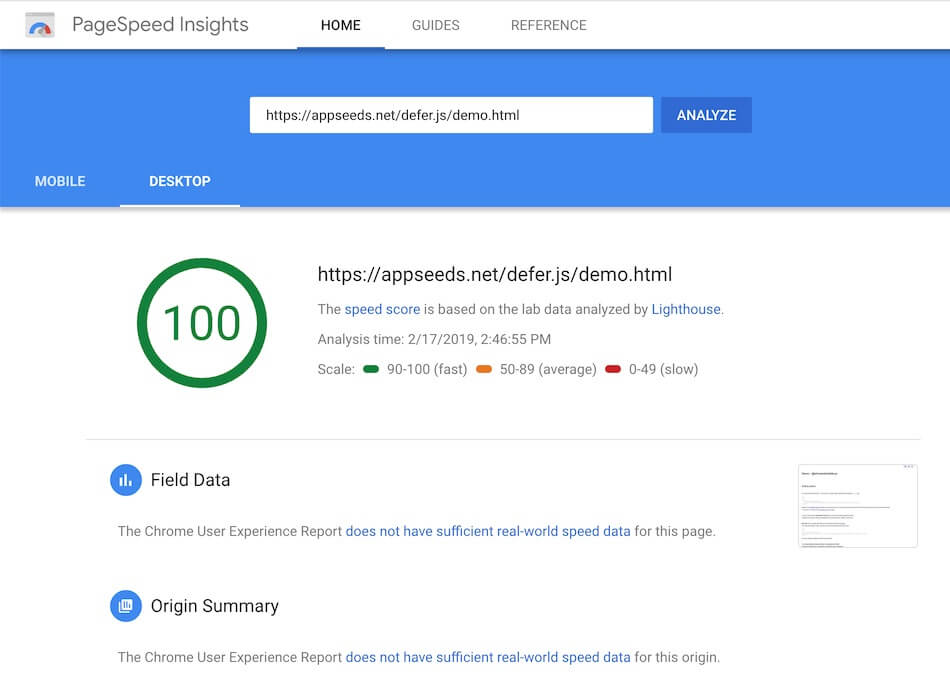

# @shinsenter/defer.js

Super tiny script to efficiently load JavaScript.

[Extended version](#extended-deferjs) supports CSS files, images and iframes. They are all easy to use.


[](https://github.com/shinsenter/defer.js/issues)


**It makes your pages feel faster.**





According to [Google's PageSpeed Insights](https://developers.google.com/speed/docs/insights/BlockingJS), loading your deferred JavaScript also means no blocking, your browsing experience needn't wait for code you may not need yet.

*TL;DR*: You can view full examples in [my demo](https://appseeds.net/defer.js/demo.html).

Looking for more complex demo? Please check [Wordpress demo](#wordpress-demo).


## Browser support

 - IE9+
 - Firefox 4+
 - Safari 3+
 - Chrome *
 - Opera *
 - Android 4+
 - iOS 3.2+

Compatibility with IE6, IE7, and IE8 has been fully dropped.


## Keep in touch

- Become a stargazer:
https://github.com/shinsenter/defer.js/stargazers

- Report an issue:
https://github.com/shinsenter/defer.js/issues

- Keep up-to-date with new releases:
https://github.com/shinsenter/defer.js/releases


## Usage

### Basic usage

You need to load this library only once on a page, ideally right after the opening `<head>` tag:

```html
<head>
    <title>My awesome page</title>
    <script src="//appseeds.net/defer.js/defer.min.js"></script>
</head>
```

Because the minified version is super tiny (less than 500 bytes), you can inline its content directly into the HTML document and avoid the network request.

If your want to lazy-load CSS files, images or iframes, let's use the [extended version](#extended-deferjs).


### Using npm

You can host [defer.js](https://npmjs.com/package/@shinsenter/defer.js) on your server, or install from [npm package](https://npmjs.com/package/@shinsenter/defer.js):

```bash
npm install @shinsenter/defer.js
```


## Methods

### defer

```javascript
defer(func [, delay ])
```

This is our hero: the `defer` function.
This will push your function `func` into queue with its delay time.
If browser's `load` event was fired, your function will be executed.

- @param   {function}  `func`    The function
- @param   {integer}   `delay`   The delay time to call the function
- @returns {void}


### deferscript

```javascript
deferscript(src, id [, delay [, callback = Function ]])
```

This function will lazy-load a script from given URL in `src` argument.
The tag id and delay time can be set in `id` and `delay` arguments.
Sometimes you may call a `callback` function when the file is loaded.

- @param   {string}        `src`         The file URL
- @param   {string|false}  `id`          The id of the &lt;script&gt; tag
- @param   {integer}       `delay`       The delay time to create the tag
- @param   {function}      `callback`    The callback function when load
- @returns {void}


## Examples

### Defer a inline script block

Delay the execution of a simple inline script (and also complex inline scipt) for 2 seconds.

```html
<script type="text/javascript">
// You can safely use defer.js without jQuery
defer(function() {
    alert("This message is shown after 2 seconds after the 'load' event.");
}, 2000);

// Or with jQuery
defer(function () {
    $('body').html('<p>Your awesome content</p>');
}, 500);
</script>
```


### Defer libraries you may not need yet

Delay loading Google Publisher Tag script for 1 second (to prevent advertisement iframes that may block rendering).

```html
<script type="text/javascript">
deferscript('//www.googletagservices.com/tag/js/gpt.js', 'gpt-js', 1000);
</script>
```

That is simple, isn't it?

---

You can delay loading Facebook, Twitter scripts for 2 second (social widgets usually are expensive resources).

```html
<script type="text/javascript">
deferscript('https://connect.facebook.net/en_US/sdk.js#xfbml=1&version=v3.2', 'facebook-sdk', 2000);
deferscript('//platform.twitter.com/widgets.js', 'twitter-sdk', 2000);
</script>
```

It saves huge amount of HTTP requests. Don't worry, all of your loved social widgets work well 2 seconds later.

---

We also lazy-load 3rd-party library's JavaScript and CSS.
Thanks to highlightjs for a lightweight, extensible syntax highlighter.

```html
<script type="text/javascript">
deferstyle('//highlightjs.org/static/demo/styles/tomorrow.css', 'highlightjs-css', 1000);
deferscript('//highlightjs.org/static/highlight.site.pack.js', 'highlightjs-api', 1000, function() {
    var code_blocks = [].slice.call(document.querySelectorAll('pre code'));
    code_blocks.forEach(function(block) {
        hljs.highlightBlock(block);
    });
});
</script>
```

The `deferstyle` function is a part of [extended version](#extended-deferjs) of deder.js.

Believe me, page speed performance is very important to us.


## Extended defer.js

I also added some extra helpers to lazy-load CSS files, images and iframes. They are all easy to use.

```html
<head>
    <title>My awesome page</title>
    <script src="//appseeds.net/defer.js/defer_plus.min.js"></script>

    <!-- You may want to add small polyfill for IE 9~11 -->
    <script>deferscript('//appseeds.net/defer.js/docs/assets/polyfill.min.js', 'polyfill-js', 1)</script>
</head>
```

**More powerful, but still light-weight.**

You can view all full examples [here](https://appseeds.net/defer.js/demo.html).


### deferstyle

```javascript
deferstyle(src, id [, delay [, callback = Function ]])
```

This function will lazy-load stylesheet from given URL in `src` argument.
The tag id and delay time can be set in `id` and `delay` arguments.
Sometimes you may call a `callback` function when the file is loaded.

- @param   {string}        `src`         The file URL
- @param   {string|false}  `id`          The id of the &lt;link&gt; tag
- @param   {integer}       `delay`       The delay time to create the tag
- @param   {function}      `callback`    The callback function when load
- @returns {void}

Example:
```html
<script type="text/javascript">
deferstyle('//highlightjs.org/static/demo/styles/tomorrow.css', 'highlightjs-css', 1000);
</script>
```


### deferimg

```javascript
deferimg(query_selector = 'img.lazy' [, delay [, load_class = 'lazied' [, callback = function(image) {} ]]])
```
The `this` in `callback` is a reference to the target `` DOM element.

- @param   {string}        `query_selector` The query selctor (default: 'img.lazy')
- @param   {integer}       `delay`          The delay time to trigger lazy-load on the image
- @param   {string|false}  `load_class`     The class name when the image is swapped its real `src`
- @param   {function}      `callback`       The callback function when the image is loaded
- @returns {void}


---

Example: Control your lazy images, anywhere, anytime.

```html


<script type="text/javascript">deferimg('img.basic', 100);</script>
```


### deferiframe

```javascript
deferiframe(query_selector = 'iframe.lazy' [, delay [, load_class = 'lazied' [, callback = function(frame) {} ]]])
```

The `this` in `callback` is a reference to the target `<iframe>` DOM element.

- @param   {string}        `query_selector` The query selctor (default: 'iframe.lazy')
- @param   {integer}       `delay`          The delay time to trigger lazy-load on the iframe
- @param   {string|false}  `load_class`     The class name when the iframe is swapped its real `src`
- @param   {function}      `callback`       The callback function when the iframe is loaded
- @returns {void}

---

Example: Lazy-load iframes (Youtube videos) with CSS effect.

```html
<style type="text/css">
.fade {
    transition: opacity 500ms ease;
    opacity: 0;
}

.fade.show {
    opacity: 1;
}
</style>

<iframe class="video fade"
    data-src="https://www.youtube.com/embed/Uz970DggW7E"
    frameborder="0" width="560" height="315" allowfullscreen
    allow="accelerometer; autoplay; encrypted-media; gyroscope; picture-in-picture"></iframe>

<script type="text/javascript">
deferiframe('iframe.video', 100, 'loaded', function(frame) {
    frame.onload = function() {
        frame.className+=' show';
    }
});
</script>
```


## Wordpress demo

I added Wordpress demo of using defer.js.

You should open both of demo links in Private Mode, or make sure browser cache were cleared before the tests.

■ Original template:
https://appseeds.net/defer.js/wp/original

■ Optimized with defer.js:
https://appseeds.net/defer.js/wp/optimized

■ *Sponsored:*
In this demo, I used one HTML template of [Wayfarer Theme](https://www.theme-junkie.com/introducing-new-theme-wayfarer/). Thanks [Phát Bùi](https://www.facebook.com/sight.love) for sharing the HTML source.

■ *Disclamers:*
I did not minify HTML, CSS and JS files. You can not get the perfect score on Pagespeed Test with this demo.

---


Released under the MIT license.
https://appseeds.net/defer.js/LICENSE

Copyright (c) 2019 Mai Nhut Tan &lt;shin@shin.company&gt;
